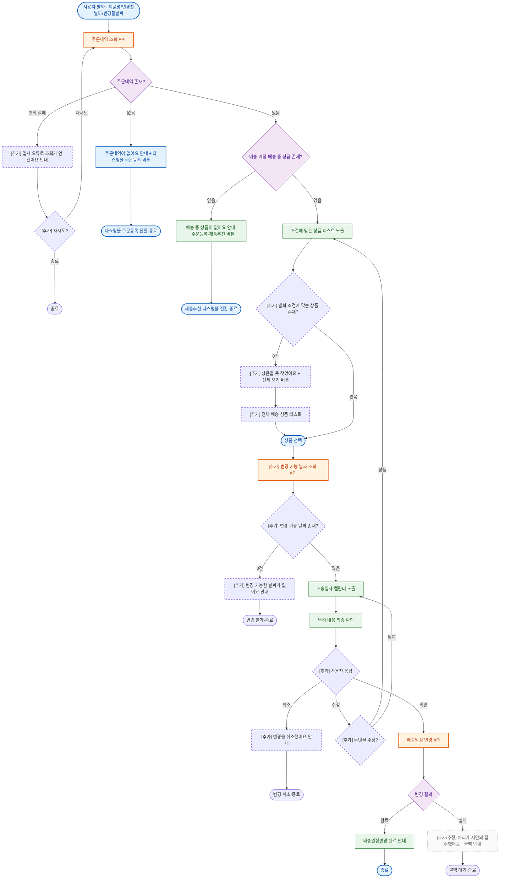

> ⚠️ 이 문서는 원본 흐름도 + AI 방어설계 보강을 포함합니다. **[추가]·[추정]** 표시 항목은 검토가 필요합니다.

# 배송일정변경 챗봇 흐름 — 검토리포트 (예시)

원본: `배송일정변경_흐름도.pptx` (슬라이드 1장) · 검토일: 2026-06-26

---

## 1. 보강 플로우차트

---

## 2. 분류 기준 표

| 구분 | 색상 | 해당 노드 |
|------|------|-----------|
| 사용자 행동 | 파랑 | 사용자 발화(A), 상품 선택(D1) |
| 화면 노출(UI) | 초록 | 주문없음 안내(B1), 배송상품없음(TS1), 상품 리스트(D), 캘린더(Cal), 최종 확인(Conf), 완료 안내(H1) |
| API 통신 | 주황 | 주문내역 조회(B), 변경가능날짜 조회(CL), 배송일정 변경(G) |
| 판단/분기 로직 | 보라 | 주문 존재(B0), 배송상품 존재(C0), 변경 결과(G0) |
| 시스템 처리 | 회색 | 각 종착 노드 |

---

## 3. 원본 / 보강 / 추정 구분표

| 노드 | 구분 | 근거(패턴) | 원본 위치 |
|------|------|-----------|-----------|
| 주문내역 조회·존재(B/B0) | 원본 | - | 슬라이드1 |
| 배송상품 존재(C0) | 원본 | - | 슬라이드1 |
| 상품 리스트·캘린더·변경 API(D/Cal/G) | 원본 | - | 슬라이드1 |
| 조회 실패 재시도(ER/ERq) | 보강 | 패턴5·8 | - |
| 발화 조건 0건 분기(D0/Dz/Dall) | 보강 | 패턴3 | - |
| 변경가능날짜 조회·0건(CL/CLc/Cz) | 보강 | 패턴7·3 | - |
| 확인/수정/취소 분기(Fu/R/X) | 보강 | 패턴6 | - |
| 변경 실패 콜백(F1) | 추정 | 패턴8·확인요망 | - |

---

## 4. 패턴 적용 체크리스트

| 패턴 | 적용 | 적용 위치 / 사유 |
|------|------|-----------------|
| 1 분류·라벨 명확화 | ✅ | 게이트 B0(존재)/C0(상태)/D0(조건) 구분 |
| 2 진입·전제 검증 | ✅ | 주문 존재(B0)·배송상품 존재(C0) → 없으면 타쇼핑몰 전환 |
| 3 빈 결과(0건) 분기 | ✅ | D0 0건, CLc 0건 |
| 4 발화 추출·결손 입력 | ➖ | 단일 캘린더라 발화 추출 분기는 별도 표(섹션 미수록)로 정리 |
| 5 재시도·반복 제한 | ✅ | 조회 실패 재시도(ERq) |
| 6 취소·수정 회귀 | ✅ | 최종 확인 확인/수정/취소(Fu) |
| 7 노드 분리·선행 데이터 | ✅ | B/B0·G/G0 분리, 캘린더 전 CL 추가 |
| 8 막다른 길 제거·실패 후속 | ✅ | 모든 leaf 종착, 변경 실패 콜백 |

---

## 5. 리스크 우선순위

| 항목 | 심각도 | 발생 시 사용자 영향 | 권고 |
|------|--------|--------------------|------|
| 배송변경 실패 후속 없음 | 🔴 치명 | 변경이 안 됐는데 됐다고 오인 → CS 폭증 | 실패 분기 + 콜백 접수 |
| 변경가능날짜 0건 시 빈 캘린더 | 🟡 중요 | 빈 화면에서 이탈 | CLc 0건 분기 |
| 발화 조건 불일치 시 빈 리스트 | 🟡 중요 | 못 찾고 막힘 | D0 0건 + 전체보기 |
| 조회 실패 시 재시도 없음 | 🟢 권장 | 일시 오류로 흐름 종료 | 재시도 분기 |

---

## 6. Before / After 노드 비교

| 노드 | Before (원본) | After (보강) | 근거 |
|------|---------------|--------------|------|
| 변경 결과(G0) | 완료만 그려짐 | 완료 / 실패(콜백) 분기 | 패턴8 |
| 최종 확인(Conf) | 확인만 있음 | 확인 / 수정(상품·날짜 회귀) / 취소 | 패턴6 |
| 캘린더(Cal) | 데이터원 불명 | 선행 조회 API(CL) + 0건 분기 | 패턴7·3 |
| leaf 노드 | 화살표 끊김 | 종착 노드로 마감 | 패턴8 |

---

## 7. 원본 대비 변경 이력

| 구분 | 내용 | 근거 |
|------|------|------|
| 노드 분리 | 주문조회·배송변경을 API+판단(B0/G0)으로 분리 | 패턴7 |
| 게이트 명확화 | B0(존재)·C0(상태)·D0(조건)으로 구분 | 패턴1 |
| 0건 분기 | 발화 불일치·변경가능날짜 0건 분기 추가 | 패턴3 |
| API 보강 | 캘린더 데이터원 '변경가능날짜 조회 API' 추가 | 패턴7 (※ 미확정) |
| 취소·수정 회귀 | 최종 확인에 확인/수정/취소 추가 | 패턴6 |
| 실패·종착 | 변경 실패 콜백, 조회 실패 재시도, 모든 leaf 종착 | 패턴8·5 |

---

## 8. 고객 확인요망

- **변경가능날짜 조회 API(CL)**: 캘린더에 노출할 날짜의 출처 API가 원본에 없음 — 별도 조회 API 필요 여부 **미확정, 고객 확인 요망**.
- **배송 예정·배송 중 판단 기준(C0)**: 상태 코드 정의 — **미확정**.
- **변경 실패 콜백 방식(F1)**: 유선 vs 접수 시스템 — **추정, 확인 요망**.
- **수정 시 날짜 개별 회귀**: 원본이 단일 캘린더라 '날짜' 일괄 회귀로 설계. 대상일/희망일 분리 필요 시 캘린더 2단계 분리 필요 — **미확정**.
